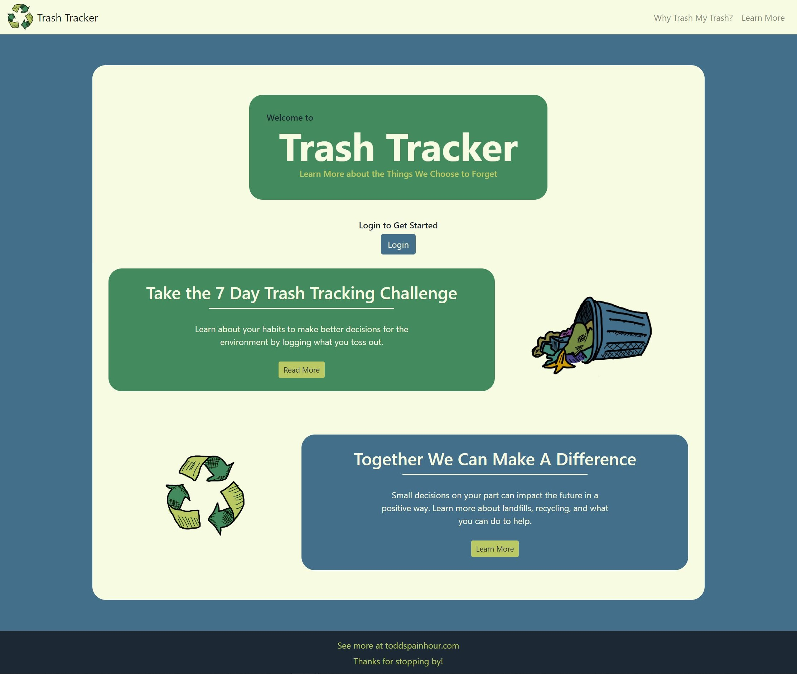

# Trash Tracker
See the site.  
https://trash-tracker-90d5a.web.app/welcome

## Description
This is my front-end capstone project to wrap up the first 6 months of my web developer training at Nashville Software School. 

## Background
I don’t know about you, but I feel guilty when I throw something away knowing it will be in a landfill for hundreds of years. I wanted to make a resource to highlight the seemingly insignificant act of throwing something away and how that decision could last for generations. The goal of Trash Tracker is twofold: make users more conscious of what they throw away and expose them to environmental facts to encourage eco-friendly decisions. Every little bit helps. 

## Screenshots

## How it Works
Once authenticated through their Google account, users can perform full CRUD on items they throw away or choose to recycle. When adding a new item, the user is asked not just for a name and description, but also the material type (dynamic dropdown), if the item they are entering is recyclable, and if they chose to recycle it or not. Once a new item is created, the user is pushed to a page where a random environmental fact that’s stored on firebase is displayed. When they return to the main page (which I refer to as My Trash) they can see the items they’ve added and relevant stats are displayed near the top of the screen.

## Technologies Used
React, Firebase, Axios, React Router, JSX, HTML5, Javascript, Sass, Bootstrap, MomentJS, NPM were used in the creation of the Trash Tracker application.

## How to Run
Clone down this repo.
Make sure you have http-server installed via npm. If not, get it here.
On your command line, run hs -p 3000.
In your browser, navigate to http://localhost:3000.
